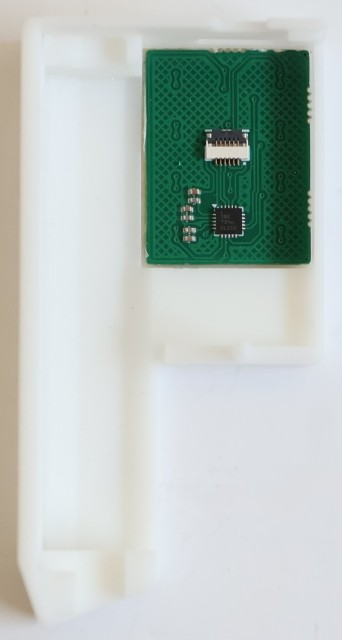
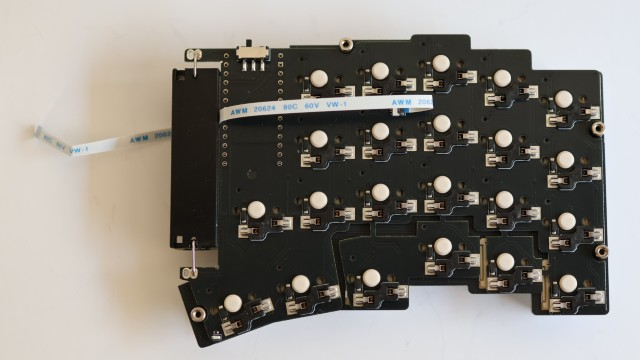
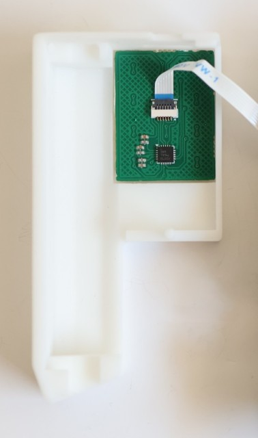
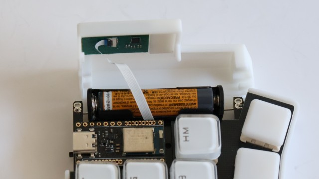

# ミニトラックパッドオプション

トラックボールを付けていない側の電池カバーに、小型のトラックパッドを取り付けるオプションです。

デフォルトでは高分解能スクロールに利用できます。

## オプションキットに含まれているもの

* ミニトラックパッド
* 150mm FPC

## オプションパーツ以外に必要なもの

* 両面テープ（はがしやすいタイプがおすすめです）

## 組み立て

* [トラックパッド対応の電池カバー](3d-models/STL/option/mini-trackpad/)を作成する
  * FDM方式で作成する場合、インフィルを100%にしないと正しく動作しない可能性が高いです。（JLCのSLA方式で製造したもののみ動作確認しています）
* 両面テープをトラックパッドの全面に貼りつけて、電池カバーに取り付ける

  ||
  |-|

* FPCケーブルを電池ボックスの側面に通し、キーボードとトラックパッドを接続する

  |||
  |-|-|

* 電池カバーをキーボード本体に取り付ける
  * FPCケーブルがBMP Boostのアンテナ部を覆ったり、コンスルーと電池カバーの間に挟まったりしないように注意してください 

  |||
  |-|-|

## ファームウェア

[build.yaml](https://github.com/sekigon-gonnoc/zmk-keyboard-torabo-tsuki-lp/blob/master/build.yaml)を編集し、トラックボール側のスニペットに`input-split-listener`、トラックパッド側のスニペットに`input-trackpad-mini`を追加してビルド
